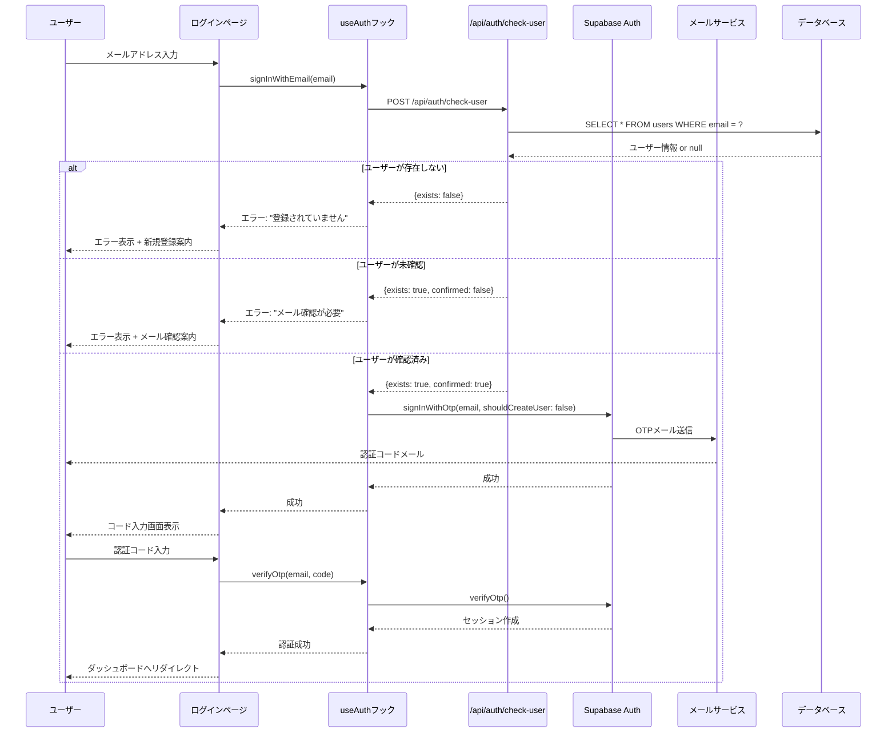
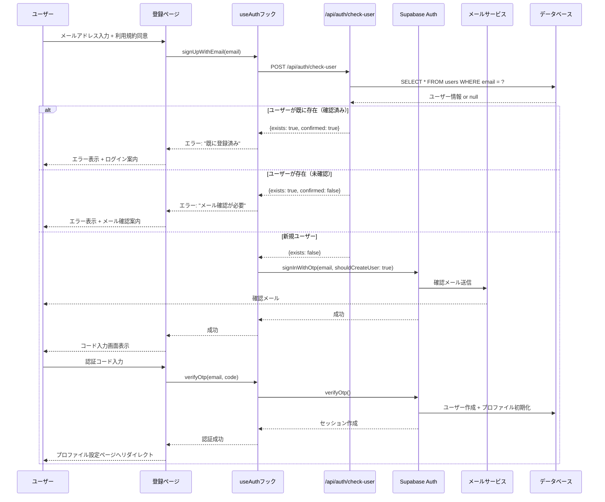
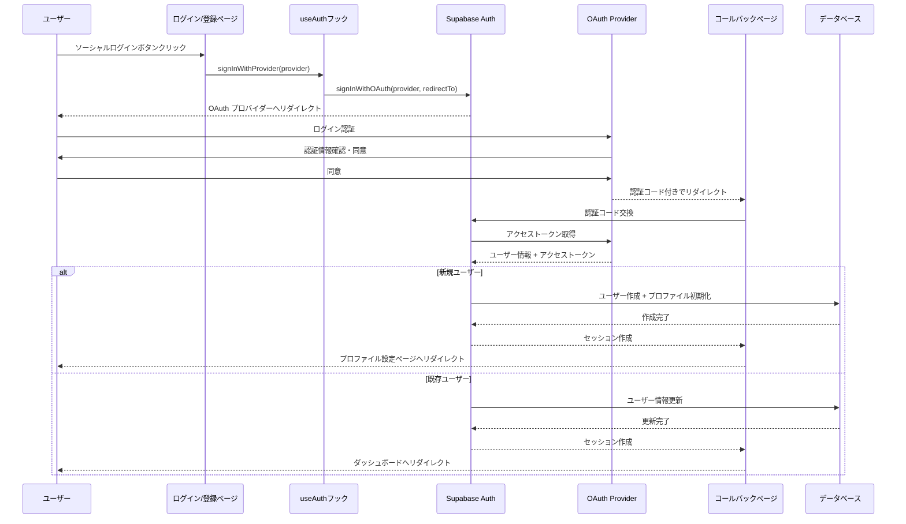
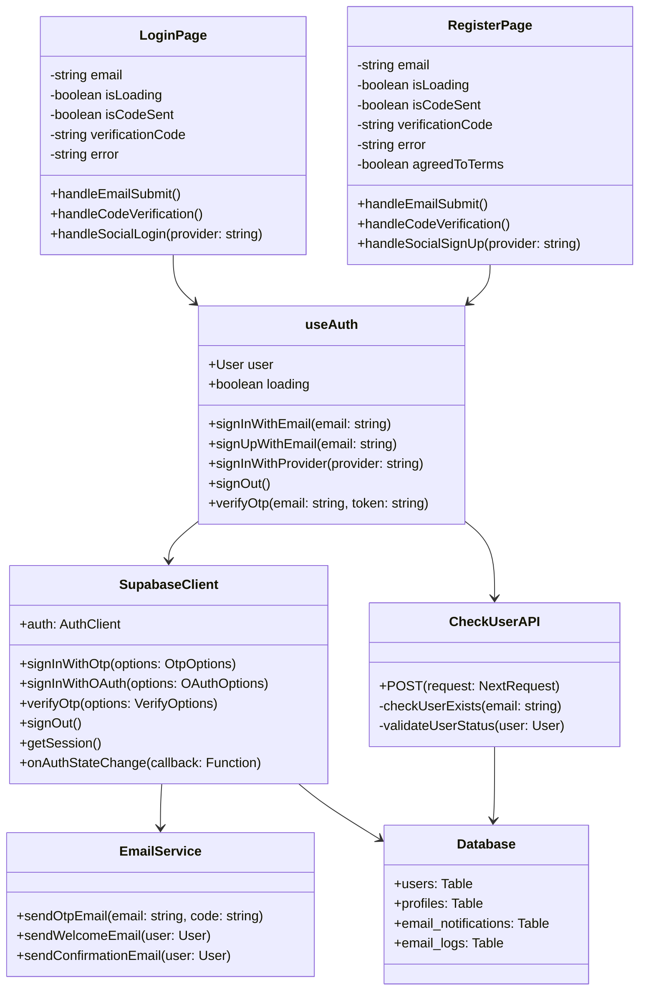
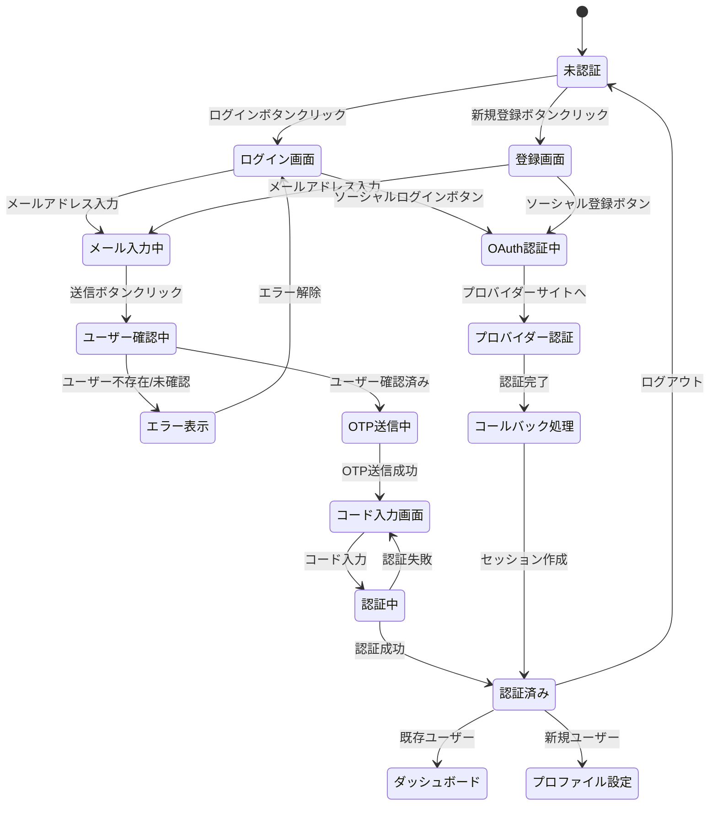
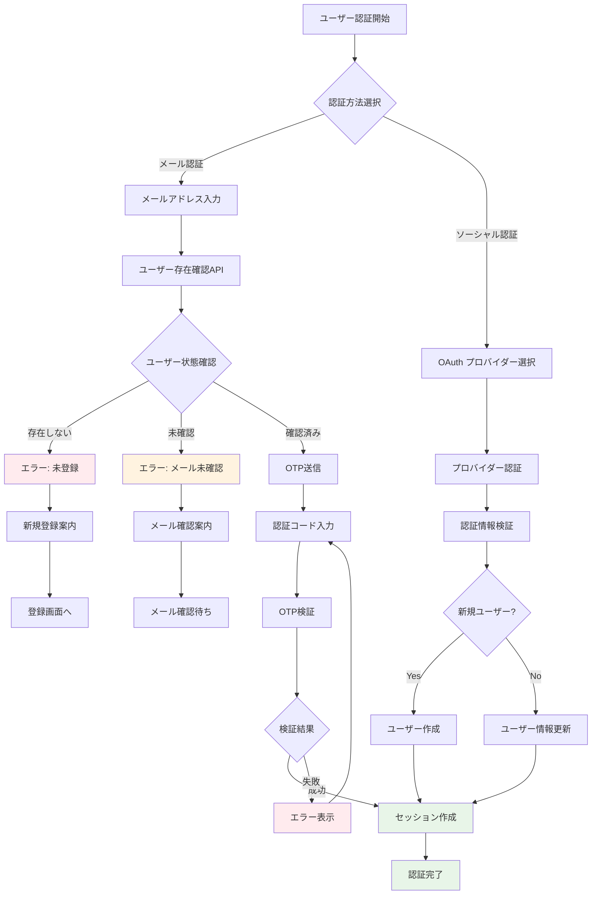

# トモリエ認証機能 UMLフロー図

## 📊 シーケンス図

### 1. メール認証フロー（ログイン）

### 2. メール認証フロー（新規登録）

### 3. ソーシャル認証フロー（Google/Facebook/LINE共通）

## 🏗️ クラス図

## 🔄 状態遷移図

## 🛡️ セキュリティフロー図

## 📋 認証フローの特徴

### ✅ **セキュリティ機能**
1. **事前ユーザー確認** - 未登録ユーザーへのスパム防止
2. **メール確認状態チェック** - 未確認ユーザーの適切な案内
3. **OAuth安全性** - CSRF保護、state検証
4. **セッション管理** - Supabase標準のセキュアセッション

### ✅ **ユーザビリティ**
1. **シニア向けUI** - 大きなボタン、明確なラベル
2. **エラーハンドリング** - 分かりやすいエラーメッセージと案内
3. **フロー分岐** - ログイン/登録の適切な振り分け
4. **利用規約同意** - GDPR対応の明示的同意

### ✅ **技術的特徴**
1. **型安全性** - TypeScript完全対応
2. **状態管理** - React Hooks活用
3. **API分離** - 認証ロジックの分離
4. **拡張性** - 新しいプロバイダー追加容易

この認証システムは、シニア向けサービスに特化した安全で使いやすい設計となっています。